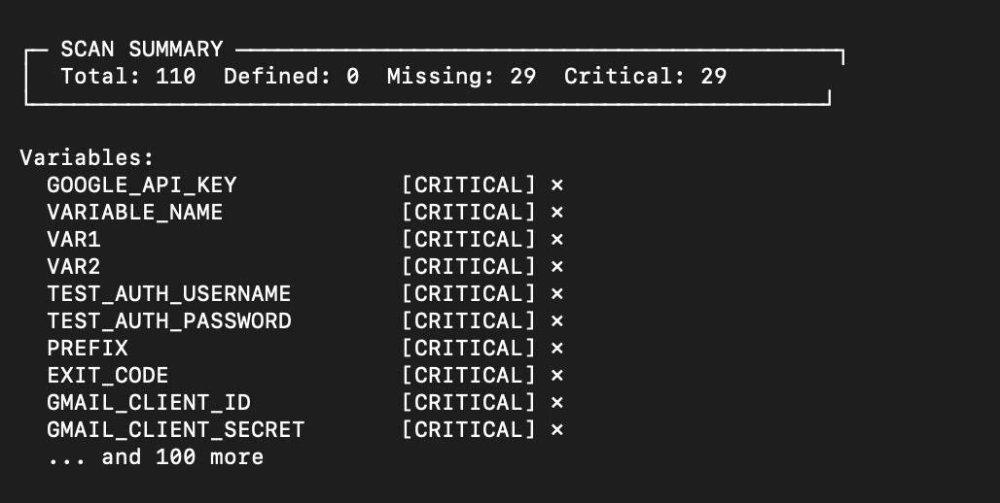

# Envark 🛡️

<div align="center">


**A production-quality MCP server and interactive TUI that maps, analyzes, and guards environment variables across your entire codebase.**

[](https://www.npmjs.com/package/envark)
[](https://opensource.org/licenses/MIT)

[Features](#features) • [Installation](#installation) • [TUI Mode](#interactive-tui) • [MCP Tools](#mcp-tools) • [Languages](#supported-languages)

</div>

---

## The Problem

Environment variables are the silent killers of production deployments:

- 💥 **Runtime crashes** from undefined variables with no defaults
- 🔓 **Security leaks** from secrets committed in the wrong files
- 📉 **Configuration drift** when .env files diverge across environments
- 😤 **Onboarding friction** when new devs don't know which vars to set
- 🗑️ **Dead code** from variables defined but never used

**Envark catches these issues before they hit production.**

---

## Features

| Feature | Description |
|---------|-------------|
| 🔍 **Multi-language parsing** | JavaScript, TypeScript, Python, Go, Rust, Shell, Docker |
| 🎯 **Risk scoring** | Critical, High, Medium, Low, Info classifications |
| 📊 **Dependency graphs** | Understand which vars cluster together |
| ✅ **Validation** | Check .env files against actual code requirements |
| 📝 **Template generation** | Auto-generate .env.example from your codebase |
| ⚡ **Fast** | Caches results, targets < 2s for 500-file projects |
| 🔒 **Private** | Pure static analysis, no data leaves your machine |
| 🖥️ **Interactive TUI** | Beautiful terminal interface with dropdown menus |
| 🤖 **MCP Server** | Integrates with Claude, Cursor, VS Code, Windsurf |
| 🧠 **AI Assistant** | OpenAI, Anthropic, Ollama for smart analysis & recommendations |

---

## Interactive TUI

Envark includes a beautiful interactive terminal interface inspired by modern security tools.

### Launch

```bash
npm install -g envark
# or
npx envark
```

### Command Menu

Type `/` to open the command dropdown with all available commands:


### Scan Results

Run `/scan` to analyze your project's environment variables:

(https://raw.githubusercontent.com/kstij/Envark/main/assets/scan.png)

### Available Commands

| Command | Shortcut | Description |
|---------|----------|-------------|
| `/scan` | `s` | Scan project for environment variables |
| `/risk` | `r` | Analyze environment variable risks |
| `/missing` | `m` | Find undefined but used variables |
| `/duplicates` | `d` | Find duplicate definitions |
| `/validate` | `v` | Validate a .env file |
| `/generate` | `g` | Generate .env.example template |
| `/graph` | `gr` | Show variable dependency graph |
| `/help` | `h` | Show help dialog |
| `/clear` | `c` | Clear the output |
| `/exit` | `q` | Exit Envark |

### AI Commands

Envark includes a powerful AI assistant that can analyze, explain, and generate environment configurations.

| Command | Shortcut | Description |
|---------|----------|-------------|
| `/ask` | `a` | Ask AI about environment variables |
| `/analyze` | `an` | AI security analysis of your project |
| `/suggest` | `su` | Get AI suggestions for a variable |
| `/explain` | `ex` | AI explains a variable's purpose |
| `/template` | `tpl` | AI generates .env for project type |
| `/config` | `cfg` | Configure AI provider |
| `/history` | `hist` | Show AI conversation history |

### AI Configuration

Configure your preferred AI provider:

```bash
# OpenAI (recommended)
/config openai sk-your-api-key gpt-4o

# Anthropic Claude
/config anthropic sk-ant-your-api-key claude-sonnet-4-20250514

# Google Gemini
/config gemini your-api-key gemini-1.5-pro

# Ollama (local, free)
/config ollama llama3.2
```

Or set environment variables:

```bash
export OPENAI_API_KEY="sk-..."        # OpenAI
export ANTHROPIC_API_KEY="sk-ant-..." # Anthropic
export GEMINI_API_KEY="..."           # Google Gemini
export OLLAMA_MODEL="llama3.2"        # Ollama model
```

### Navigation

- **Type `/`** — Open command menu
- **Arrow ↓↑** — Navigate dropdown
- **Tab** — Autocomplete selected command  
- **Enter** — Execute command
- **Ctrl+C** — Clear output or exit

---

## Installation

### Quick Start (No Installation)

```bash
# Interactive TUI
npx envark

# Or with bun
bunx envark
```

### Global Installation

```bash
npm install -g envark
envark
```

### From Source

```bash
git clone https://github.com/yourusername/envark.git
cd envark
npm install
npm run build
npm start
```

---

## MCP Integration

Envark works as an MCP (Model Context Protocol) server, giving AI assistants deep visibility into your environment configuration.

### VS Code

Create `.vscode/mcp.json`:

```json
{
  "servers": {
    "envark": {
      "type": "stdio",
      "command": "npx",
      "args": ["-y", "envark"]
    }
  }
}
```

### Claude Code / Cursor / Windsurf

Add to your MCP configuration:

```json
{
  "mcpServers": {
    "envark": {
      "command": "npx",
      "args": ["-y", "envark"]
    }
  }
}
```

### Auto-Configure

```bash
envark init vscode    # VS Code
envark init claude    # Claude Code
envark init cursor    # Cursor
envark init windsurf  # Windsurf
```

---

## MCP Tools

When used as an MCP server, Envark exposes these tools to AI assistants:

### `get_env_map`

Returns the complete environment variable map for your project.

```json
{
  "summary": {
    "totalEnvVars": 24,
    "defined": 20,
    "missing": 3,
    "critical": 2
  },
  "variables": [...]
}
```

### `get_env_risk`

Analyzes all variables and returns risk assessments:

```json
{
  "summary": { "critical": 2, "high": 1, "medium": 5 },
  "riskReport": [
    {
      "name": "STRIPE_SECRET_KEY",
      "riskLevel": "critical",
      "issues": [{ "message": "Used but not defined" }]
    }
  ]
}
```

### `get_missing_envs`

Find variables that will cause runtime crashes:

```json
{
  "missing": [
    { "name": "API_SECRET", "usageCount": 3, "dangerLevel": "critical" }
  ],
  "willCauseRuntimeCrash": 2
}
```

### `validate_env_file`

Validate a .env file against code requirements:

```json
{
  "valid": false,
  "results": {
    "passed": [{ "variable": "PORT" }],
    "failed": [{ "variable": "JWT_SECRET", "issue": "Missing" }]
  }
}
```

### `generate_env_template`

Auto-generate .env.example from your codebase:

```json
{
  "content": "# Database\nDATABASE_URL=your-secret-here\n...",
  "variableCount": 18,
  "requiredCount": 5
}
```

**Additional tools:** `get_duplicates`, `get_undocumented`, `get_env_usage`, `get_env_graph`

---

## Supported Languages

| Language | Extensions | Env Access Patterns |
|----------|------------|---------------------|
| JavaScript | .js, .jsx, .mjs | `process.env.VAR`, `import.meta.env.VAR` |
| TypeScript | .ts, .tsx, .mts | `process.env.VAR`, `import.meta.env.VAR` |
| Python | .py | `os.environ['VAR']`, `os.getenv('VAR')` |
| Go | .go | `os.Getenv("VAR")`, `os.LookupEnv("VAR")` |
| Rust | .rs | `env::var("VAR")`, `std::env::var("VAR")` |
| Shell | .sh, .bash, .zsh | `$VAR`, `${VAR}`, `${VAR:-default}` |
| Docker | Dockerfile | `ENV VAR=value`, `ARG VAR` |
| Env Files | .env* | `KEY=VALUE` |

---

## How It Works

### 1. Scanning
Recursively walks your project with intelligent filtering (respects .gitignore, skips node_modules).

### 2. Parsing
Extracts environment variable usages using language-specific patterns.

### 3. Resolution
Links definitions (.env files) with usages (code) and documentation (.env.example).

### 4. Risk Analysis
Assigns risk scores based on:
- **Critical** — Used but never defined, no default
- **High** — Secret-like name in committed file
- **Medium** — Multiple usages, no default
- **Low** — Undocumented or unused
- **Info** — Fully configured

### 5. Caching
Results cached to `.envark/cache.json` with smart invalidation.

---

## CLI Reference

```bash
envark                     # Launch interactive TUI
envark scan                # Scan and show results
envark risk                # Show risk analysis
envark missing             # Show missing variables
envark validate .env       # Validate env file
envark generate            # Generate .env.example
envark init <ide>          # Configure for IDE
envark help                # Show help
envark --version           # Show version
```

---

## Contributing

Contributions welcome! Please read our contributing guidelines.

```bash
git clone https://github.com/yourusername/envark.git
cd envark
npm install
npm run build
npm test
```

---

## License

MIT License - see [LICENSE](LICENSE) for details.

---

<div align="center">

**Built with ❤️ for developers who are tired of production env var bugs.**

[Report Bug](https://github.com/yourusername/envark/issues) • [Request Feature](https://github.com/yourusername/envark/issues)

</div>
